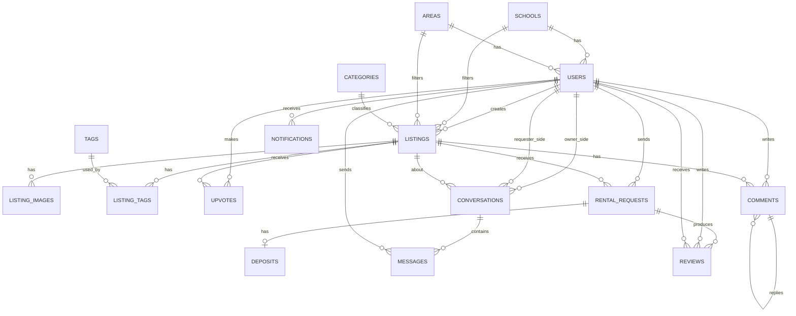

# Database Designer

## 1. Mô Tả Database

Database của UniShare dùng để lưu trữ dữ liệu cho ứng dụng mobile chia sẻ đồ dùng sinh viên, bao gồm tài khoản người dùng, hồ sơ sinh viên, bài đăng cho thuê/cho mượn, ảnh sản phẩm, tag, bình luận, upvote, yêu cầu thuê/mượn, chat realtime, đánh giá uy tín, thông báo và đặt cọc.

Hệ quản trị cơ sở dữ liệu đề xuất: **Microsoft SQL Server**. Backend sử dụng **ASP.NET Core Web API (.NET 8)** và có thể thao tác dữ liệu thông qua **Entity Framework Core**.

Thiết kế database ưu tiên các mục tiêu sau:

- Dữ liệu rõ ràng, dễ map sang Entity trong ASP.NET Core.
- Tách riêng dữ liệu nghiệp vụ chính: người dùng, bài đăng, yêu cầu thuê/mượn, chat, đánh giá, thông báo.
- Hỗ trợ tìm kiếm theo từ khóa, loại đồ, tag, trường học, khu vực và trạng thái bài đăng.
- Hỗ trợ mở rộng cho đặt cọc trực tuyến và tích hợp cổng thanh toán ở giai đoạn sau.
- Có soft delete cho các dữ liệu người dùng tạo như bài đăng, bình luận, tin nhắn để hạn chế mất lịch sử nghiệp vụ.

Ghi chú triển khai:

- Khóa chính dùng kiểu `UNIQUEIDENTIFIER`, sinh bằng `NEWID()` hoặc tạo từ backend.
- Thời gian lưu theo `DATETIME2`.
- Các trạng thái dạng enum có thể lưu bằng `TINYINT` hoặc `NVARCHAR(30)`. Trong tài liệu này mô tả bằng tên enum để dễ đọc.
- Nếu backend dùng ASP.NET Core Identity, bảng `Users` có thể được thay bằng `AspNetUsers`; các bảng nghiệp vụ vẫn tham chiếu đến khóa người dùng tương ứng.

Các enum chính:

| Enum | Giá trị đề xuất | Ý nghĩa |
| --- | --- | --- |
| `ListingType` | `Rent`, `Borrow` | Cho thuê hoặc cho mượn miễn phí |
| `ListingStatus` | `Draft`, `Available`, `Reserved`, `InUse`, `Closed`, `Hidden` | Trạng thái bài đăng |
| `RequestStatus` | `Pending`, `Accepted`, `Rejected`, `Cancelled`, `InProgress`, `Completed` | Trạng thái yêu cầu thuê/mượn |
| `DepositStatus` | `None`, `Pending`, `Paid`, `Refunded`, `Forfeited`, `Cancelled` | Trạng thái đặt cọc |
| `NotificationType` | `Upvote`, `Comment`, `Message`, `RentalRequest`, `RequestStatus`, `Review` | Loại thông báo |
| `MessageStatus` | `Sent`, `Read`, `Deleted` | Trạng thái tin nhắn |

## 2. Sơ Đồ ER (Entity Relationship)

## 3. Chi Tiết Các Bảng

### 3.1. `Schools`

Lưu danh sách trường đại học/cao đẳng để người dùng và bài đăng có thể lọc theo trường.

| Cột | Kiểu dữ liệu | Ghi chú |
| --- | --- | --- |
| `Id` | `UNIQUEIDENTIFIER` | Primary key |
| `Name` | `NVARCHAR(150)` | Tên trường |
| `ShortName` | `NVARCHAR(50)` | Tên viết tắt, ví dụ `HCMUS`, `UIT` |
| `City` | `NVARCHAR(100)` | Thành phố |
| `IsActive` | `BIT` | Trường còn được chọn hay không |
| `CreatedAt` | `DATETIME2` | Ngày tạo |

### 3.2. `Areas`

Lưu khu vực giao dịch như quận/huyện, khu ký túc xá, khu gần trường.

| Cột | Kiểu dữ liệu | Ghi chú |
| --- | --- | --- |
| `Id` | `UNIQUEIDENTIFIER` | Primary key |
| `Name` | `NVARCHAR(150)` | Tên khu vực |
| `City` | `NVARCHAR(100)` | Thành phố |
| `Description` | `NVARCHAR(300)` | Mô tả ngắn, nullable |
| `IsActive` | `BIT` | Khu vực còn được chọn hay không |
| `CreatedAt` | `DATETIME2` | Ngày tạo |

### 3.3. `Users`

Lưu thông tin tài khoản và hồ sơ cơ bản của sinh viên.

| Cột | Kiểu dữ liệu | Ghi chú |
| --- | --- | --- |
| `Id` | `UNIQUEIDENTIFIER` | Primary key |
| `Email` | `NVARCHAR(256)` | Email đăng nhập, unique |
| `PhoneNumber` | `NVARCHAR(20)` | Số điện thoại, nullable, unique nếu có |
| `PasswordHash` | `NVARCHAR(MAX)` | Mật khẩu đã hash |
| `FullName` | `NVARCHAR(150)` | Họ tên |
| `AvatarUrl` | `NVARCHAR(500)` | Ảnh đại diện, nullable |
| `SchoolId` | `UNIQUEIDENTIFIER` | FK đến `Schools`, nullable |
| `AreaId` | `UNIQUEIDENTIFIER` | FK đến `Areas`, nullable |
| `ReputationScore` | `DECIMAL(5,2)` | Điểm uy tín, mặc định `100.00` |
| `TotalReviews` | `INT` | Tổng số đánh giá đã nhận |
| `IsVerified` | `BIT` | Đã xác thực email/số điện thoại |
| `IsActive` | `BIT` | Tài khoản còn hoạt động |
| `CreatedAt` | `DATETIME2` | Ngày tạo |
| `UpdatedAt` | `DATETIME2` | Ngày cập nhật |

### 3.4. `Categories`

Lưu loại đồ dùng như máy tính cầm tay, giáo trình, dụng cụ thực hành, máy ảnh, áo tốt nghiệp, dụng cụ thể thao.

| Cột | Kiểu dữ liệu | Ghi chú |
| --- | --- | --- |
| `Id` | `UNIQUEIDENTIFIER` | Primary key |
| `Name` | `NVARCHAR(100)` | Tên loại đồ |
| `Slug` | `NVARCHAR(120)` | Dùng cho URL/filter, unique |
| `Description` | `NVARCHAR(300)` | Mô tả, nullable |
| `IsActive` | `BIT` | Loại đồ còn được dùng hay không |
| `CreatedAt` | `DATETIME2` | Ngày tạo |

### 3.5. `Tags`

Lưu tag để gắn vào bài đăng, ví dụ `casio`, `giáo trình`, `nhiếp ảnh`, `thực hành`.

| Cột | Kiểu dữ liệu | Ghi chú |
| --- | --- | --- |
| `Id` | `UNIQUEIDENTIFIER` | Primary key |
| `Name` | `NVARCHAR(80)` | Tên tag |
| `Slug` | `NVARCHAR(100)` | Dạng chuẩn hóa, unique |
| `CreatedAt` | `DATETIME2` | Ngày tạo |

### 3.6. `Listings`

Lưu bài đăng cho thuê/cho mượn đồ dùng.

| Cột | Kiểu dữ liệu | Ghi chú |
| --- | --- | --- |
| `Id` | `UNIQUEIDENTIFIER` | Primary key |
| `OwnerId` | `UNIQUEIDENTIFIER` | FK đến `Users`, người đăng bài |
| `CategoryId` | `UNIQUEIDENTIFIER` | FK đến `Categories` |
| `SchoolId` | `UNIQUEIDENTIFIER` | FK đến `Schools`, nullable |
| `AreaId` | `UNIQUEIDENTIFIER` | FK đến `Areas`, nullable |
| `Title` | `NVARCHAR(200)` | Tiêu đề bài đăng |
| `Description` | `NVARCHAR(2000)` | Mô tả chi tiết |
| `ListingType` | `NVARCHAR(20)` | `Rent` hoặc `Borrow` |
| `Status` | `NVARCHAR(30)` | Trạng thái bài đăng |
| `PricePerDay` | `DECIMAL(18,2)` | Giá thuê theo ngày, `0` nếu cho mượn |
| `DepositAmount` | `DECIMAL(18,2)` | Tiền cọc đề xuất, nullable |
| `ConditionNote` | `NVARCHAR(500)` | Tình trạng đồ dùng, nullable |
| `ViewCount` | `INT` | Số lượt xem |
| `UpvoteCount` | `INT` | Số lượt upvote |
| `CommentCount` | `INT` | Số bình luận |
| `CreatedAt` | `DATETIME2` | Ngày tạo |
| `UpdatedAt` | `DATETIME2` | Ngày cập nhật |
| `DeletedAt` | `DATETIME2` | Soft delete, nullable |

### 3.7. `ListingImages`

Lưu danh sách ảnh của bài đăng.

| Cột | Kiểu dữ liệu | Ghi chú |
| --- | --- | --- |
| `Id` | `UNIQUEIDENTIFIER` | Primary key |
| `ListingId` | `UNIQUEIDENTIFIER` | FK đến `Listings` |
| `ImageUrl` | `NVARCHAR(500)` | Đường dẫn ảnh |
| `DisplayOrder` | `INT` | Thứ tự hiển thị |
| `IsCover` | `BIT` | Có phải ảnh đại diện bài đăng không |
| `CreatedAt` | `DATETIME2` | Ngày tạo |

### 3.8. `ListingTags`

Bảng nối nhiều-nhiều giữa bài đăng và tag.

| Cột | Kiểu dữ liệu | Ghi chú |
| --- | --- | --- |
| `ListingId` | `UNIQUEIDENTIFIER` | FK đến `Listings` |
| `TagId` | `UNIQUEIDENTIFIER` | FK đến `Tags` |
| `CreatedAt` | `DATETIME2` | Ngày tạo |

Primary key đề xuất: `ListingId`, `TagId`.

### 3.9. `Upvotes`

Lưu lượt upvote của người dùng trên bài đăng.

| Cột | Kiểu dữ liệu | Ghi chú |
| --- | --- | --- |
| `Id` | `UNIQUEIDENTIFIER` | Primary key |
| `ListingId` | `UNIQUEIDENTIFIER` | FK đến `Listings` |
| `UserId` | `UNIQUEIDENTIFIER` | FK đến `Users` |
| `CreatedAt` | `DATETIME2` | Ngày upvote |

### 3.10. `Comments`

Lưu bình luận trên bài đăng.

| Cột | Kiểu dữ liệu | Ghi chú |
| --- | --- | --- |
| `Id` | `UNIQUEIDENTIFIER` | Primary key |
| `ListingId` | `UNIQUEIDENTIFIER` | FK đến `Listings` |
| `UserId` | `UNIQUEIDENTIFIER` | FK đến `Users` |
| `ParentCommentId` | `UNIQUEIDENTIFIER` | FK đến `Comments`, nullable |
| `Content` | `NVARCHAR(1000)` | Nội dung bình luận |
| `CreatedAt` | `DATETIME2` | Ngày tạo |
| `UpdatedAt` | `DATETIME2` | Ngày cập nhật |
| `DeletedAt` | `DATETIME2` | Soft delete, nullable |

### 3.11. `RentalRequests`

Lưu yêu cầu thuê/mượn đồ dùng.

| Cột | Kiểu dữ liệu | Ghi chú |
| --- | --- | --- |
| `Id` | `UNIQUEIDENTIFIER` | Primary key |
| `ListingId` | `UNIQUEIDENTIFIER` | FK đến `Listings` |
| `RequesterId` | `UNIQUEIDENTIFIER` | FK đến `Users`, người gửi yêu cầu |
| `OwnerId` | `UNIQUEIDENTIFIER` | FK đến `Users`, người sở hữu bài đăng |
| `Status` | `NVARCHAR(30)` | Trạng thái yêu cầu |
| `StartDate` | `DATETIME2` | Ngày bắt đầu thuê/mượn dự kiến |
| `EndDate` | `DATETIME2` | Ngày trả dự kiến |
| `Message` | `NVARCHAR(500)` | Lời nhắn, nullable |
| `TotalPrice` | `DECIMAL(18,2)` | Tổng tiền thuê dự kiến |
| `DepositAmount` | `DECIMAL(18,2)` | Tiền cọc áp dụng, nullable |
| `CreatedAt` | `DATETIME2` | Ngày gửi yêu cầu |
| `UpdatedAt` | `DATETIME2` | Ngày cập nhật |

### 3.12. `Deposits`

Lưu thông tin đặt cọc cho yêu cầu thuê/mượn. MVP có thể chỉ lưu trạng thái và số tiền, chưa cần tích hợp thanh toán thật.

| Cột | Kiểu dữ liệu | Ghi chú |
| --- | --- | --- |
| `Id` | `UNIQUEIDENTIFIER` | Primary key |
| `RentalRequestId` | `UNIQUEIDENTIFIER` | FK đến `RentalRequests`, unique |
| `Amount` | `DECIMAL(18,2)` | Số tiền cọc |
| `Status` | `NVARCHAR(30)` | Trạng thái đặt cọc |
| `PaymentProvider` | `NVARCHAR(50)` | Nhà cung cấp thanh toán, nullable |
| `ProviderTransactionId` | `NVARCHAR(150)` | Mã giao dịch từ cổng thanh toán, nullable |
| `PaidAt` | `DATETIME2` | Thời điểm thanh toán, nullable |
| `RefundedAt` | `DATETIME2` | Thời điểm hoàn cọc, nullable |
| `CreatedAt` | `DATETIME2` | Ngày tạo |
| `UpdatedAt` | `DATETIME2` | Ngày cập nhật |

### 3.13. `Conversations`

Lưu hội thoại giữa chủ bài đăng và người quan tâm.

| Cột | Kiểu dữ liệu | Ghi chú |
| --- | --- | --- |
| `Id` | `UNIQUEIDENTIFIER` | Primary key |
| `ListingId` | `UNIQUEIDENTIFIER` | FK đến `Listings` |
| `RentalRequestId` | `UNIQUEIDENTIFIER` | FK đến `RentalRequests`, nullable |
| `OwnerId` | `UNIQUEIDENTIFIER` | FK đến `Users`, chủ bài đăng |
| `RequesterId` | `UNIQUEIDENTIFIER` | FK đến `Users`, người hỏi/thuê/mượn |
| `LastMessageAt` | `DATETIME2` | Thời điểm tin nhắn cuối, nullable |
| `CreatedAt` | `DATETIME2` | Ngày tạo |

### 3.14. `Messages`

Lưu tin nhắn trong hội thoại.

| Cột | Kiểu dữ liệu | Ghi chú |
| --- | --- | --- |
| `Id` | `UNIQUEIDENTIFIER` | Primary key |
| `ConversationId` | `UNIQUEIDENTIFIER` | FK đến `Conversations` |
| `SenderId` | `UNIQUEIDENTIFIER` | FK đến `Users` |
| `Content` | `NVARCHAR(2000)` | Nội dung tin nhắn |
| `Status` | `NVARCHAR(20)` | `Sent`, `Read`, `Deleted` |
| `ReadAt` | `DATETIME2` | Thời điểm đọc, nullable |
| `CreatedAt` | `DATETIME2` | Ngày gửi |
| `DeletedAt` | `DATETIME2` | Soft delete, nullable |

### 3.15. `Reviews`

Lưu đánh giá uy tín giữa người dùng sau giao dịch.

| Cột | Kiểu dữ liệu | Ghi chú |
| --- | --- | --- |
| `Id` | `UNIQUEIDENTIFIER` | Primary key |
| `RentalRequestId` | `UNIQUEIDENTIFIER` | FK đến `RentalRequests` |
| `ReviewerId` | `UNIQUEIDENTIFIER` | FK đến `Users`, người đánh giá |
| `RevieweeId` | `UNIQUEIDENTIFIER` | FK đến `Users`, người được đánh giá |
| `Rating` | `INT` | Điểm từ `1` đến `5` |
| `Comment` | `NVARCHAR(1000)` | Nội dung đánh giá, nullable |
| `ReputationDelta` | `DECIMAL(5,2)` | Mức tăng/giảm điểm uy tín |
| `CreatedAt` | `DATETIME2` | Ngày đánh giá |

### 3.16. `Notifications`

Lưu thông báo gửi đến người dùng.

| Cột | Kiểu dữ liệu | Ghi chú |
| --- | --- | --- |
| `Id` | `UNIQUEIDENTIFIER` | Primary key |
| `UserId` | `UNIQUEIDENTIFIER` | FK đến `Users`, người nhận |
| `Type` | `NVARCHAR(30)` | Loại thông báo |
| `Title` | `NVARCHAR(200)` | Tiêu đề |
| `Body` | `NVARCHAR(500)` | Nội dung ngắn |
| `ReferenceId` | `UNIQUEIDENTIFIER` | Id đối tượng liên quan, nullable |
| `ReferenceType` | `NVARCHAR(50)` | Loại đối tượng liên quan, nullable |
| `IsRead` | `BIT` | Đã đọc hay chưa |
| `CreatedAt` | `DATETIME2` | Ngày tạo |
| `ReadAt` | `DATETIME2` | Ngày đọc, nullable |

## 4. Quy Tắc Dữ Liệu Theo Bảng (DB Rule)

### `Schools`

- `Name` không được rỗng.
- `ShortName` nên unique nếu có dữ liệu.
- Chỉ hiển thị các trường có `IsActive = 1` trên app.

### `Areas`

- `Name` và `City` không được rỗng.
- Không xóa cứng khu vực đã được tham chiếu bởi user hoặc bài đăng; chỉ đổi `IsActive = 0`.

### `Users`

- `Email` bắt buộc unique.
- `PhoneNumber` unique nếu người dùng đã nhập.
- `PasswordHash` không lưu mật khẩu plain text.
- `ReputationScore` mặc định `100.00`.
- `TotalReviews` mặc định `0`.
- Người dùng bị khóa hoặc inactive không được tạo bài đăng, gửi yêu cầu, bình luận, upvote hoặc nhắn tin.

### `Categories`

- `Name` và `Slug` bắt buộc unique.
- Không xóa cứng category đã có bài đăng; chỉ đổi `IsActive = 0`.

### `Tags`

- `Slug` bắt buộc unique.
- Tag nên được chuẩn hóa chữ thường, bỏ khoảng trắng thừa trước khi lưu.

### `Listings`

- `Title`, `Description`, `OwnerId`, `CategoryId`, `ListingType`, `Status` bắt buộc.
- `PricePerDay` phải lớn hơn hoặc bằng `0`.
- Nếu `ListingType = Borrow` thì `PricePerDay = 0`.
- `DepositAmount` phải lớn hơn hoặc bằng `0` nếu có.
- Người đăng bài không được tự gửi yêu cầu thuê/mượn bài của chính mình.
- Bài đăng chỉ được tìm kiếm công khai khi `Status = Available` và `DeletedAt IS NULL`.
- Khi yêu cầu thuê/mượn được chấp nhận, bài đăng có thể chuyển sang `Reserved` hoặc `InUse` tùy luồng nghiệp vụ.

### `ListingImages`

- Mỗi bài đăng nên có tối thiểu 1 ảnh và tối đa 10 ảnh.
- Mỗi bài đăng chỉ có 1 ảnh `IsCover = 1`.
- `DisplayOrder` không âm và không trùng trong cùng một bài đăng.

### `ListingTags`

- Cặp `ListingId`, `TagId` là duy nhất.
- Một bài đăng nên giới hạn tối đa 10 tag để tránh spam.

### `Upvotes`

- Cặp `ListingId`, `UserId` là duy nhất.
- Người dùng không được upvote bài đăng đã bị xóa hoặc ẩn.
- Khi thêm/xóa upvote phải cập nhật `Listings.UpvoteCount`.

### `Comments`

- `Content` không được rỗng.
- Chỉ cho phép bình luận trên bài đăng chưa bị xóa.
- Nếu là reply, `ParentCommentId` phải thuộc cùng `ListingId`.
- Khi thêm/xóa mềm bình luận phải cập nhật `Listings.CommentCount`.

### `RentalRequests`

- `RequesterId` không được trùng với `OwnerId`.
- `StartDate` phải nhỏ hơn hoặc bằng `EndDate`.
- Chỉ tạo yêu cầu cho bài đăng có `Status = Available`.
- Một người dùng không nên có nhiều yêu cầu `Pending` cho cùng một bài đăng.
- Chỉ chủ bài đăng được chấp nhận hoặc từ chối yêu cầu.
- Khi yêu cầu chuyển sang `Accepted`, các yêu cầu `Pending` khác của cùng bài đăng có thể được giữ nguyên hoặc tự động từ chối tùy quyết định sản phẩm. MVP đề xuất tự động từ chối để tránh trùng lịch.

### `Deposits`

- Mỗi `RentalRequest` chỉ có tối đa 1 bản ghi đặt cọc.
- `Amount` phải lớn hơn `0` nếu yêu cầu có đặt cọc.
- Chỉ cập nhật `Status = Paid` khi có xác nhận thanh toán hợp lệ.
- Không hoàn cọc nếu trạng thái hiện tại không phải `Paid`.

### `Conversations`

- Một cặp `ListingId`, `OwnerId`, `RequesterId` chỉ nên có 1 hội thoại.
- `OwnerId` và `RequesterId` không được trùng nhau.
- Chỉ 2 người trong hội thoại được xem và gửi tin nhắn.

### `Messages`

- `Content` không được rỗng.
- `SenderId` phải là `OwnerId` hoặc `RequesterId` trong hội thoại.
- Tin nhắn xóa mềm giữ lại metadata để phục vụ kiểm tra tranh chấp.
- Khi gửi tin nhắn mới phải cập nhật `Conversations.LastMessageAt`.

### `Reviews`

- Chỉ được đánh giá khi `RentalRequests.Status = Completed`.
- Mỗi người dùng chỉ được đánh giá người còn lại 1 lần cho cùng một `RentalRequest`.
- `Rating` nằm trong khoảng `1` đến `5`.
- `ReviewerId` và `RevieweeId` không được trùng nhau.
- Sau khi tạo review phải cập nhật `Users.ReputationScore` và `Users.TotalReviews` của người được đánh giá.

### `Notifications`

- `UserId`, `Type`, `Title`, `Body` bắt buộc.
- `IsRead` mặc định `0`.
- Khi người dùng mở thông báo, cập nhật `IsRead = 1` và `ReadAt`.

## 5. Luồng Nghiệp Vụ Chính

### 5.1. Đăng ký và cập nhật hồ sơ

1. Người dùng đăng ký bằng email/số điện thoại và mật khẩu.
2. Backend kiểm tra email/số điện thoại chưa tồn tại.
3. Tạo bản ghi trong `Users` với `ReputationScore = 100.00`, `TotalReviews = 0`, `IsActive = 1`.
4. Người dùng cập nhật `FullName`, `AvatarUrl`, `SchoolId`, `AreaId`.

### 5.2. Đăng bài cho thuê/cho mượn

1. Người dùng tạo bài đăng trong `Listings`.
2. Backend kiểm tra user đang active, category hợp lệ, giá thuê và tiền cọc hợp lệ.
3. Lưu ảnh vào `ListingImages`, trong đó có 1 ảnh cover.
4. Lưu tag vào `Tags` nếu tag chưa tồn tại, sau đó tạo liên kết trong `ListingTags`.
5. Bài đăng được hiển thị khi `Status = Available`.

### 5.3. Tìm kiếm và lọc đồ dùng

1. Người dùng nhập từ khóa hoặc chọn bộ lọc.
2. Backend truy vấn `Listings` với điều kiện `Status = Available` và `DeletedAt IS NULL`.
3. Có thể lọc theo `CategoryId`, `SchoolId`, `AreaId`, `TagId`, `ListingType`.
4. Kết quả trả về kèm ảnh cover, tên chủ bài đăng, điểm uy tín, giá thuê và khu vực.

### 5.4. Upvote và bình luận

1. Người dùng upvote bài đăng, backend tạo bản ghi `Upvotes`.
2. Nếu đã upvote trước đó thì có thể hủy upvote bằng cách xóa bản ghi.
3. Backend cập nhật `Listings.UpvoteCount`.
4. Khi bình luận, backend tạo bản ghi `Comments`, cập nhật `Listings.CommentCount`.
5. Chủ bài đăng nhận thông báo trong `Notifications`.

### 5.5. Gửi yêu cầu thuê/mượn

1. Người dùng bấm yêu cầu thuê/mượn từ chi tiết bài đăng.
2. Backend kiểm tra người gửi không phải chủ bài đăng và bài đăng đang `Available`.
3. Tạo bản ghi `RentalRequests` với `Status = Pending`.
4. Nếu cần đặt cọc, tạo bản ghi `Deposits` với `Status = Pending`.
5. Chủ bài đăng nhận thông báo yêu cầu mới.

### 5.6. Chấp nhận hoặc từ chối yêu cầu

1. Chủ bài đăng xem danh sách yêu cầu từ `RentalRequests`.
2. Nếu chấp nhận, cập nhật yêu cầu sang `Accepted` hoặc `InProgress`.
3. Bài đăng chuyển sang `Reserved` hoặc `InUse`.
4. Các yêu cầu đang chờ khác của cùng bài đăng có thể chuyển sang `Rejected`.
5. Người gửi yêu cầu nhận thông báo kết quả.

### 5.7. Chat realtime giữa người dùng

1. Khi người dùng quan tâm bài đăng, hệ thống tạo hoặc lấy `Conversations` theo `ListingId`, `OwnerId`, `RequesterId`.
2. Tin nhắn mới được lưu vào `Messages`.
3. SignalR gửi realtime message đến người nhận.
4. Tạo thông báo `Message` nếu người nhận không đang mở hội thoại.
5. Khi người nhận đọc tin nhắn, cập nhật `Messages.ReadAt` và `Status = Read`.

### 5.8. Hoàn tất giao dịch và đánh giá

1. Khi đồ dùng đã được trả hoặc giao dịch kết thúc, chủ bài đăng hoặc người thuê/mượn cập nhật `RentalRequests.Status = Completed`.
2. Hai bên có thể tạo đánh giá trong `Reviews`.
3. Backend tính `ReputationDelta` dựa trên `Rating`.
4. Cập nhật `Users.ReputationScore` và `Users.TotalReviews` cho người được đánh giá.
5. Người được đánh giá nhận thông báo `Review`.

### 5.9. Đặt cọc và hoàn cọc

1. Khi yêu cầu thuê/mượn cần cọc, tạo `Deposits` với `Status = Pending`.
2. Sau khi thanh toán thành công, cập nhật `Status = Paid`, `PaidAt` và mã giao dịch.
3. Khi giao dịch hoàn tất bình thường, cập nhật `Status = Refunded`, `RefundedAt`.
4. Nếu phát sinh vi phạm, hệ thống có thể chuyển `Status = Forfeited` sau khi có xử lý nghiệp vụ.
