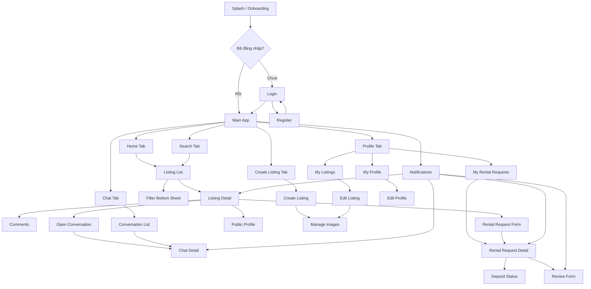
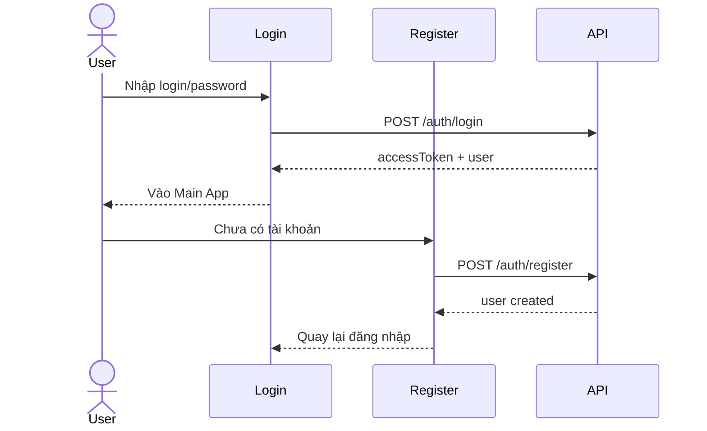
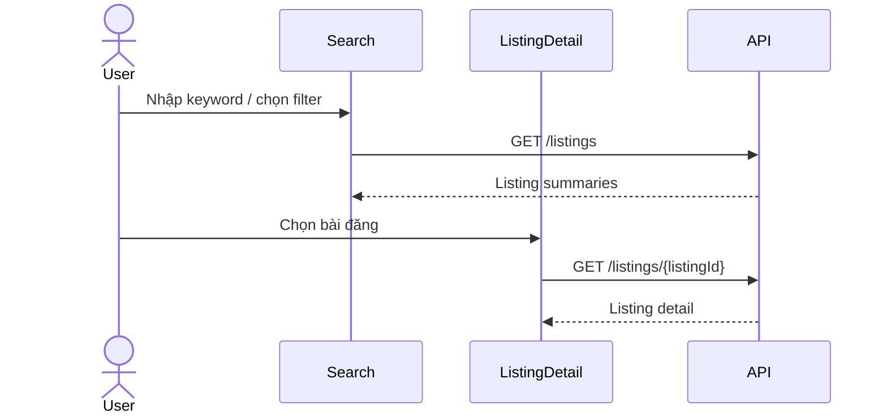
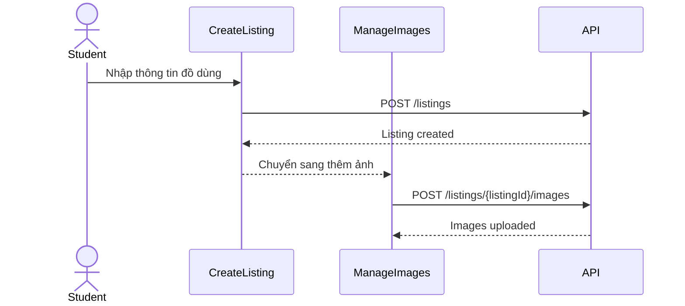
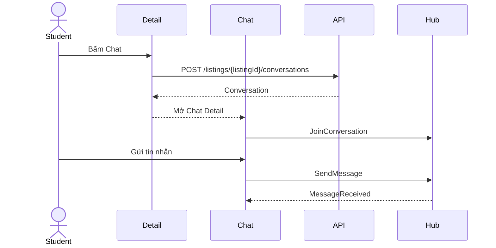
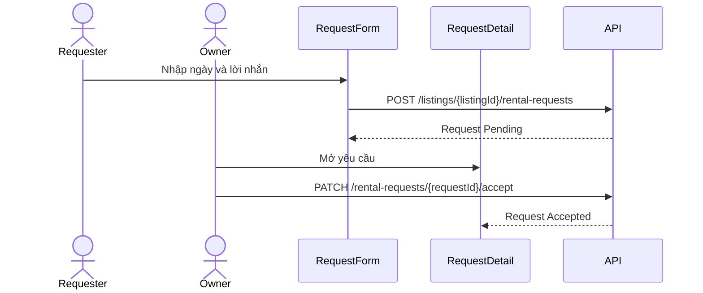
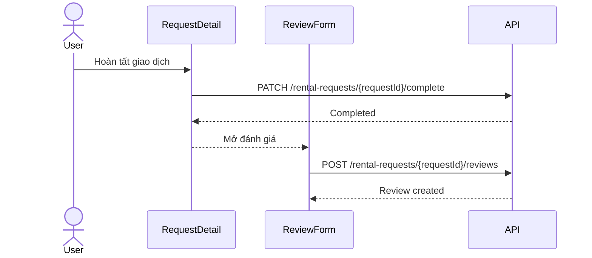
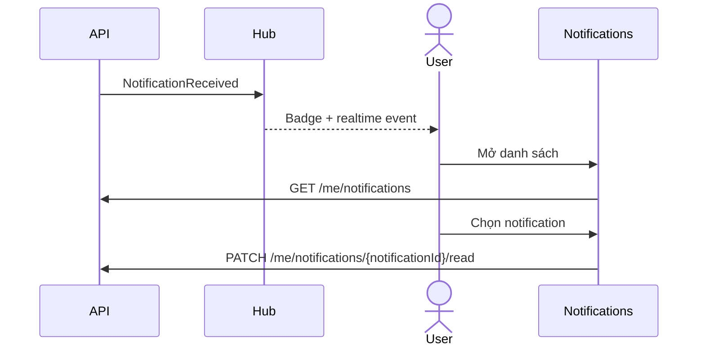

# UI Sitemap And Wireframe

## 1. Mục tiêu tài liệu

- Định nghĩa cấu trúc màn hình và điều hướng chính cho ứng dụng mobile UniShare.
- Đồng bộ với `/docs/03-functional/01-functional-requirements.md` và `/docs/02-architecture/02-api-spec.md`.
- Làm nền cho thiết kế UI chi tiết, triển khai Flutter và kiểm thử UI.
- Bao phủ các luồng MVP cho sinh viên: đăng nhập, tìm kiếm đồ dùng, đăng bài, chat, thuê/mượn, đặt cọc cơ bản, đánh giá và thông báo.

## 2. Quy ước

### 2.1. Ký hiệu wireframe

| Ký hiệu    | Ý nghĩa                                            |
| ---------- | -------------------------------------------------- |
| `[Button]` | Nút thao tác                                       |
| `[Input]`  | Ô nhập liệu                                        |
| `[Card]`   | Thẻ hiển thị dữ liệu                               |
| `[Tab]`    | Tab trong bottom navigation hoặc segmented control |
| `[Modal]`  | Modal hoặc bottom sheet                            |
| `{API}`    | API được gọi bởi màn hình                          |
| `{FR}`     | Use case được màn hình hỗ trợ                      |

Wireframe trong tài liệu này là wireframe text/ASCII để mô tả bố cục và chức năng, không phải thiết kế visual cuối cùng.

### 2.2. Quy ước trạng thái màn hình

Mỗi màn hình chính cần xét các state sau:

- **Loading**: đang tải dữ liệu từ API.
- **Empty**: không có dữ liệu phù hợp.
- **Error**: API lỗi hoặc kết nối thất bại.
- **Unauthorized**: người dùng chưa đăng nhập nhưng truy cập chức năng yêu cầu đăng nhập.
- **Forbidden**: người dùng không có quyền với dữ liệu, ví dụ không phải chủ bài đăng hoặc không thuộc hội thoại.
- **Success**: thao tác hoàn tất, có toast/snackbar hoặc chuyển màn hình phù hợp.

### 2.3. Quy ước traceability

- Mã use case dùng format `FR-001`, `FR-002`, ...
- API dùng route rút gọn theo `/api/v1`, ví dụ `GET /listings` tương ứng `GET /api/v1/listings`.
- Mỗi màn hình chính phải map đến ít nhất một use case và một nhóm API nếu có tương tác backend.

### 2.4. Quy ước màu sắc

## 3. Phạm vi UI MVP

Tài liệu này chỉ thiết kế UI cho **Flutter mobile app dành cho sinh viên**.

Trong phạm vi:

- Khách chưa đăng nhập xem/tìm kiếm bài đăng công khai.
- Sinh viên đăng ký, đăng nhập, quản lý hồ sơ.
- Sinh viên đăng bài cho thuê/cho mượn, quản lý ảnh, tag, loại đồ, trường và khu vực.
- Sinh viên upvote, bình luận, chat, gửi yêu cầu thuê/mượn.
- Chủ bài đăng xử lý yêu cầu thuê/mượn.
- Hai bên theo dõi đặt cọc cơ bản, hoàn tất giao dịch và đánh giá.
- Sinh viên nhận và đọc thông báo.

Ngoài phạm vi UI MVP:

- Web admin/dashboard quản trị.
- Tích hợp giao diện thanh toán thật với cổng thanh toán.
- Tranh chấp nâng cao, báo cáo vi phạm và moderation chi tiết.

`FR-022` được ghi nhận trong traceability nhưng không có wireframe chi tiết trong mobile MVP.

## 4. Phân tích vai trò và quyền truy cập UI

| Vai trò                | Màn hình được truy cập                                                            | Giới hạn UI                                                             |
| ---------------------- | --------------------------------------------------------------------------------- | ----------------------------------------------------------------------- |
| Khách chưa đăng nhập   | Splash, Login, Register, Home, Search, Listing Detail, Public Profile             | Khi bấm upvote, comment, chat hoặc gửi yêu cầu thì điều hướng đến Login |
| Sinh viên đã đăng nhập | Toàn bộ màn hình mobile MVP trừ màn hình admin                                    | Chỉ chỉnh sửa dữ liệu của chính mình                                    |
| Chủ bài đăng           | My Listings, Edit Listing, Manage Images, Rental Request Detail, Chat, Review     | Không thấy nút gửi yêu cầu thuê/mượn trên bài đăng của mình             |
| Người thuê/mượn        | Listing Detail, Rental Request Form, Request Detail, Deposit Status, Chat, Review | Không thao tác chấp nhận/từ chối yêu cầu                                |
| Quản trị viên          | Ngoài phạm vi mobile MVP                                                          | Không thiết kế wireframe trong tài liệu này                             |

## 5. Sitemap tổng thể



### 5.1. Nhóm màn hình

| Nhóm               | Màn hình chính                                           | Mục tiêu                                  |
| ------------------ | -------------------------------------------------------- | ----------------------------------------- |
| Auth               | Splash, Login, Register                                  | Xác định phiên đăng nhập và tạo tài khoản |
| Discovery          | Home, Search, Filter, Listing Detail                     | Khám phá và tìm đồ dùng                   |
| Listing Management | Create Listing, Edit Listing, Manage Images, My Listings | Đăng và quản lý đồ dùng                   |
| Interaction        | Upvote, Comments, Public Profile                         | Tương tác cộng đồng                       |
| Chat               | Conversation List, Chat Detail                           | Nhắn tin trực tiếp                        |
| Rental             | Request Form, Request Detail, Deposit Status             | Gửi và xử lý yêu cầu thuê/mượn            |
| Review             | Review Form, User Reviews                                | Đánh giá và cập nhật uy tín               |
| Notification       | Notification List                                        | Theo dõi sự kiện liên quan                |
| Profile            | My Profile, Edit Profile                                 | Quản lý thông tin cá nhân                 |

## 6. Navigation chính

### 6.1. Bottom navigation

| Tab     | Màn hình gốc             | Ghi chú                                                  |
| ------- | ------------------------ | -------------------------------------------------------- |
| Home    | `HomeScreen`             | Feed bài đăng mới/đề xuất                                |
| Search  | `SearchScreen`           | Tìm kiếm và lọc nâng cao                                 |
| Post    | `CreateListingScreen`    | Yêu cầu đăng nhập                                        |
| Chat    | `ConversationListScreen` | Yêu cầu đăng nhập                                        |
| Profile | `ProfileScreen`          | Yêu cầu đăng nhập, nếu chưa đăng nhập hiển thị CTA login |

### 6.2. Stack navigation theo tab

| Stack         | Luồng màn hình                                                                                                                       |
| ------------- | ------------------------------------------------------------------------------------------------------------------------------------ |
| Home Stack    | Home -> Listing Detail -> Comments/Public Profile/Rental Request/Chat                                                                |
| Search Stack  | Search -> Filter Sheet -> Listing Detail                                                                                             |
| Post Stack    | Create Listing -> Manage Images -> Success                                                                                           |
| Chat Stack    | Conversation List -> Chat Detail                                                                                                     |
| Profile Stack | Profile -> Edit Profile -> My Listings -> Edit Listing -> Manage Images -> My Requests -> Request Detail -> Deposit Status -> Review |

### 6.3. Modal và bottom sheet

| Component            | Dùng ở màn hình                                                   | Nội dung                                               |
| -------------------- | ----------------------------------------------------------------- | ------------------------------------------------------ |
| Filter Bottom Sheet  | Home, Search                                                      | Category, tag, school, area, listing type, price range |
| Category Picker      | Create/Edit Listing, Filter                                       | Chọn loại đồ active                                    |
| Tag Picker           | Create/Edit Listing, Filter                                       | Nhập/chọn tag                                          |
| School/Area Picker   | Profile, Create/Edit Listing, Filter                              | Chọn trường/khu vực active                             |
| Confirm Action Modal | Close/Delete Listing, Accept/Reject Request, Complete Transaction | Xác nhận trước khi đổi trạng thái                      |
| Login Required Modal | Listing Detail, Comments, Chat, Request                           | Mời đăng nhập khi khách tương tác                      |

## 7. Danh sách màn hình

| Mã       | Màn hình               | Vai trò                       | Use case                               | API chính                                                                                        |
| -------- | ---------------------- | ----------------------------- | -------------------------------------- | ------------------------------------------------------------------------------------------------ |
| `UI-001` | Splash / Onboarding    | Khách, Sinh viên              | `FR-002`                               | Local token, `POST /auth/refresh-token`                                                          |
| `UI-002` | Login                  | Khách                         | `FR-002`                               | `POST /auth/login`                                                                               |
| `UI-003` | Register               | Khách                         | `FR-001`                               | `POST /auth/register`                                                                            |
| `UI-004` | Home / Listing List    | Khách, Sinh viên              | `FR-009`, `FR-010`                     | `GET /listings`                                                                                  |
| `UI-005` | Search + Filter        | Khách, Sinh viên              | `FR-010`                               | `GET /listings`, `GET /categories`, `GET /tags`, `GET /schools`, `GET /areas`                    |
| `UI-006` | Listing Detail         | Khách, Sinh viên              | `FR-004`, `FR-009`, `FR-011`, `FR-015` | `GET /listings/{listingId}`, `PUT/DELETE /listings/{listingId}/upvote`                           |
| `UI-007` | Comments               | Khách, Sinh viên              | `FR-012`                               | `GET/POST /listings/{listingId}/comments`, `PUT/DELETE /comments/{commentId}`                    |
| `UI-008` | Create Listing         | Sinh viên                     | `FR-005`, `FR-008`                     | `POST /listings`, metadata APIs                                                                  |
| `UI-009` | Edit Listing           | Chủ bài đăng                  | `FR-006`, `FR-008`                     | `PUT /listings/{listingId}`, `PATCH /listings/{listingId}/close`, `DELETE /listings/{listingId}` |
| `UI-010` | Manage Images          | Chủ bài đăng                  | `FR-007`                               | `POST/PATCH/PUT/DELETE /listings/{listingId}/images`                                             |
| `UI-011` | Conversation List      | Sinh viên                     | `FR-013`                               | `GET /me/conversations`                                                                          |
| `UI-012` | Chat Detail            | Sinh viên                     | `FR-014`                               | `GET/POST /conversations/{conversationId}/messages`, `/hubs/chat`                                |
| `UI-013` | Rental Request Form    | Người thuê/mượn               | `FR-015`                               | `POST /listings/{listingId}/rental-requests`                                                     |
| `UI-014` | Rental Request Detail  | Chủ bài đăng, Người thuê/mượn | `FR-016`, `FR-017`, `FR-019`           | `GET /rental-requests/{requestId}`, status patch APIs                                            |
| `UI-015` | Deposit Status         | Chủ bài đăng, Người thuê/mượn | `FR-018`                               | `GET /rental-requests/{requestId}/deposit`, deposit patch APIs                                   |
| `UI-016` | Review Form            | Chủ bài đăng, Người thuê/mượn | `FR-020`                               | `POST /rental-requests/{requestId}/reviews`                                                      |
| `UI-017` | Notifications          | Sinh viên                     | `FR-021`                               | `GET/PATCH /me/notifications`                                                                    |
| `UI-018` | Profile / Edit Profile | Sinh viên                     | `FR-003`, `FR-004`                     | `GET /users/me`, `PUT /users/me`, `GET /users/{userId}`                                          |
| `UI-019` | My Listings            | Chủ bài đăng                  | `FR-006`                               | `GET /me/listings`                                                                               |
| `UI-020` | My Rental Requests     | Chủ bài đăng, Người thuê/mượn | `FR-017`                               | `GET /me/rental-requests`                                                                        |

## 8. Wireframe chi tiết

### 8.1. `UI-001` Splash / Onboarding

Mục tiêu: kiểm tra phiên đăng nhập và điều hướng vào Login hoặc Main App.

```text
+--------------------------------+
|            UniShare            |
|  Chia sẻ đồ dùng sinh viên     |
|                                |
|          [Loading...]          |
+--------------------------------+
```

Thành phần UI:

- Logo/tên app.
- Loading indicator.
- Optional onboarding message cho lần mở đầu tiên.

Hành động chính:

- Nếu có token hợp lệ: vào Main App.
- Nếu token hết hạn: gọi refresh token.
- Nếu chưa có phiên: vào Login hoặc Home guest tùy cấu hình.

API liên quan: `POST /auth/refresh-token`.

State cần có: Loading, Error, Unauthorized.

### 8.2. `UI-002` Login

Mục tiêu: đăng nhập vào app.

```text
+--------------------------------+
| UniShare                       |
|                                |
| [Input] Email/Số điện thoại    |
| [Input] Mật khẩu               |
|                                |
| [Button] Đăng nhập             |
| [Link] Tạo tài khoản mới       |
| [Link] Xem đồ trước            |
+--------------------------------+
```

Thành phần UI:

- Input login.
- Input password.
- Button đăng nhập.
- Link sang Register.
- Link xem app ở chế độ khách.

Hành động chính:

- Submit login.
- Điều hướng sang Register.
- Vào Home ở guest mode.

API liên quan: `POST /auth/login`.

Use case: `FR-002`.

State cần có: Loading, Error, Success.

### 8.3. `UI-003` Register

Mục tiêu: tạo tài khoản sinh viên.

```text
+--------------------------------+
| Tạo tài khoản                  |
| [Input] Họ tên                 |
| [Input] Email                  |
| [Input] Số điện thoại          |
| [Input] Mật khẩu               |
|                                |
| [Button] Đăng ký               |
| [Link] Đã có tài khoản         |
+--------------------------------+
```

Thành phần UI:

- Họ tên.
- Email.
- Số điện thoại.
- Mật khẩu.
- Button đăng ký.

Hành động chính:

- Tạo tài khoản.
- Quay lại Login.

API liên quan: `POST /auth/register`.

Use case: `FR-001`.

State cần có: Loading, Error, Success.

### 8.4. `UI-004` Home / Listing List

Mục tiêu: hiển thị danh sách đồ dùng đang khả dụng.

```text
+--------------------------------+
| UniShare        [Bell] [Avatar]|
| [Search bar: Tìm đồ dùng...]   |
| [Chip] Gần bạn [Chip] Trường   |
|                                |
| [Card] Ảnh | Tên đồ            |
|        Giá/ngày | Khu vực      |
|        Chủ bài | Điểm uy tín   |
|                                |
| [Card] ...                     |
|                                |
| [Home] [Search] [+] [Chat] [Me]|
+--------------------------------+
```

Thành phần UI:

- Search bar.
- Filter chips nhanh.
- Listing cards.
- Notification icon.
- Bottom navigation.

Hành động chính:

- Chọn bài đăng để xem chi tiết.
- Mở Search/Filter.
- Mở Notifications.
- Pull-to-refresh danh sách.

API liên quan: `GET /listings`, `GET /me/notifications/unread-count`.

Use case: `FR-009`, `FR-010`, `FR-021`.

State cần có: Loading, Empty, Error, Unauthorized optional cho notification.

### 8.5. `UI-005` Search + Filter

Mục tiêu: tìm đồ dùng theo từ khóa và bộ lọc.

```text
+--------------------------------+
| [Back] Tìm kiếm                |
| [Input] Nhập tên đồ cần tìm    |
| [Button] Bộ lọc                |
|                                |
| Kết quả                        |
| [Card] Listing summary         |
| [Card] Listing summary         |
+--------------------------------+

[Filter Bottom Sheet]
+--------------------------------+
| Loại đồ                        |
| [Category chips]               |
| Trường / Khu vực               |
| [Picker] [Picker]              |
| Hình thức: [Thuê] [Mượn]       |
| Giá: [Min] - [Max]             |
| [Button] Áp dụng               |
+--------------------------------+
```

Thành phần UI:

- Search input.
- Filter bottom sheet.
- Result list.
- Empty state gợi ý đổi bộ lọc.

Hành động chính:

- Tìm theo keyword.
- Áp dụng/xóa bộ lọc.
- Mở Listing Detail.

API liên quan: `GET /listings`, `GET /categories`, `GET /tags`, `GET /schools`, `GET /areas`.

Use case: `FR-010`.

State cần có: Loading, Empty, Error.

### 8.6. `UI-006` Listing Detail

Mục tiêu: xem thông tin chi tiết món đồ và thực hiện tương tác.

```text
+--------------------------------+
| [Back]                  [Share]|
| [Image carousel]               |
| Tên đồ                         |
| Giá/ngày | Tiền cọc | Trạng thái|
| [Tag] [Tag] [School] [Area]    |
|                                |
| Chủ bài: Avatar Tên Uy tín     |
| Mô tả                          |
| Tình trạng đồ                  |
|                                |
| [Upvote] [Comment] [Chat]      |
| [Button] Gửi yêu cầu thuê/mượn |
+--------------------------------+
```

Thành phần UI:

- Image carousel.
- Listing status, type, price, deposit.
- Owner summary.
- Tags, school, area.
- Upvote/comment/chat actions.
- Primary CTA gửi yêu cầu.

Hành động chính:

- Upvote/hủy upvote.
- Mở Comments.
- Mở Chat.
- Mở Rental Request Form.
- Mở Public Profile chủ bài.

API liên quan: `GET /listings/{listingId}`, `PUT /listings/{listingId}/upvote`, `DELETE /listings/{listingId}/upvote`, `POST /listings/{listingId}/conversations`.

Use case: `FR-004`, `FR-009`, `FR-011`, `FR-013`, `FR-015`.

State cần có: Loading, Error, Unauthorized, Forbidden, Success.

Business UI rules:

- Khách bấm upvote/comment/chat/request thì hiển thị Login Required Modal.
- Chủ bài không thấy nút gửi yêu cầu thuê/mượn.
- Nếu bài không `Available`, disable nút gửi yêu cầu.

### 8.7. `UI-007` Comments

Mục tiêu: xem và tạo bình luận cho bài đăng.

```text
+--------------------------------+
| [Back] Bình luận               |
| [Comment] User - Nội dung      |
|   [Reply]                      |
| [Comment] User - Nội dung      |
|                                |
| [Input] Viết bình luận... [Send]|
+--------------------------------+
```

Thành phần UI:

- Danh sách comment.
- Reply action.
- Input gửi comment.
- Menu sửa/xóa cho comment của mình.

Hành động chính:

- Tải comment.
- Gửi comment/reply.
- Sửa/xóa comment của mình.

API liên quan: `GET /listings/{listingId}/comments`, `POST /listings/{listingId}/comments`, `PUT /comments/{commentId}`, `DELETE /comments/{commentId}`.

Use case: `FR-012`.

State cần có: Loading, Empty, Error, Unauthorized, Forbidden, Success.

### 8.8. `UI-008` Create Listing

Mục tiêu: tạo bài đăng cho thuê/cho mượn.

```text
+--------------------------------+
| [Back] Đăng đồ dùng            |
| [Input] Tên đồ                 |
| [Input] Mô tả                  |
| [Picker] Loại đồ               |
| [Segment] Cho thuê | Cho mượn  |
| [Input] Giá/ngày               |
| [Input] Tiền cọc               |
| [Input] Tình trạng đồ          |
| [Picker] Trường                |
| [Picker] Khu vực               |
| [Tag input]                    |
| [Button] Tiếp tục thêm ảnh     |
+--------------------------------+
```

Thành phần UI:

- Form thông tin bài đăng.
- Category picker.
- Listing type segmented control.
- Tag input.
- School/area picker.

Hành động chính:

- Validate form.
- Tạo listing.
- Chuyển sang Manage Images.

API liên quan: `POST /listings`, `GET /categories`, `GET /tags`, `GET /schools`, `GET /areas`.

Use case: `FR-005`, `FR-008`.

State cần có: Loading, Error, Unauthorized, Success.

Business UI rules:

- Nếu chọn `Cho mượn`, field giá/ngày tự đặt `0` và disable.
- Giá thuê và tiền cọc không được âm.
- Category, school, area chỉ lấy dữ liệu active.

### 8.9. `UI-009` Edit Listing

Mục tiêu: chỉnh sửa, đóng hoặc xóa mềm bài đăng của mình.

```text
+--------------------------------+
| [Back] Sửa bài đăng      [More]|
| [Form giống Create Listing]    |
|                                |
| [Button] Lưu thay đổi          |
| [Button] Đóng bài đăng         |
| [Button] Xóa bài đăng          |
+--------------------------------+
```

Thành phần UI:

- Form giống Create Listing.
- Action close/delete.
- Confirm modal trước thao tác nguy hiểm.

Hành động chính:

- Cập nhật bài đăng.
- Đóng bài.
- Xóa mềm bài.
- Mở Manage Images.

API liên quan: `PUT /listings/{listingId}`, `PATCH /listings/{listingId}/close`, `DELETE /listings/{listingId}`.

Use case: `FR-006`, `FR-008`.

State cần có: Loading, Error, Forbidden, Success.

Business UI rules:

- Chỉ chủ bài đăng được vào màn hình này.
- Nếu bài đang `InProgress`, disable close/delete hoặc hiển thị lý do không thể thao tác.

### 8.10. `UI-010` Manage Images

Mục tiêu: upload, sắp xếp và chọn ảnh cover cho bài đăng.

```text
+--------------------------------+
| [Back] Ảnh bài đăng            |
| [Grid image] [Grid image] [+]  |
| [Badge] Cover                  |
|                                |
| [Button] Chọn làm ảnh bìa      |
| [Button] Lưu thứ tự            |
| [Button] Hoàn tất              |
+--------------------------------+
```

Thành phần UI:

- Image grid.
- Upload button.
- Cover badge.
- Reorder interaction.

Hành động chính:

- Upload ảnh.
- Xóa ảnh.
- Đổi ảnh cover.
- Lưu thứ tự.

API liên quan: `POST /listings/{listingId}/images`, `PATCH /listings/{listingId}/images/{imageId}/cover`, `PUT /listings/{listingId}/images/order`, `DELETE /listings/{listingId}/images/{imageId}`.

Use case: `FR-007`.

State cần có: Loading, Empty, Error, Forbidden, Success.

### 8.11. `UI-011` Conversation List

Mục tiêu: xem các hội thoại của người dùng.

```text
+--------------------------------+
| Tin nhắn                       |
| [Search conversations]         |
|                                |
| [Conversation] Avatar Tên      |
| Listing title                  |
| Last message        Time       |
|                                |
| [Home] [Search] [+] [Chat] [Me]|
+--------------------------------+
```

Thành phần UI:

- Conversation list.
- Last message preview.
- Unread indicator.

Hành động chính:

- Mở Chat Detail.
- Refresh danh sách.

API liên quan: `GET /me/conversations`.

Use case: `FR-013`.

State cần có: Loading, Empty, Error, Unauthorized.

### 8.12. `UI-012` Chat Detail

Mục tiêu: nhắn tin realtime giữa hai người liên quan đến bài đăng.

```text
+--------------------------------+
| [Back] Tên người chat          |
| Listing: Máy tính Casio        |
|--------------------------------|
|     [Bubble received]          |
| [Bubble sent]                  |
|     [Bubble received]          |
|--------------------------------|
| [Input] Nhập tin nhắn... [Send]|
+--------------------------------+
```

Thành phần UI:

- Header người nhận.
- Listing context.
- Message bubbles.
- Input gửi tin.
- Read status.

Hành động chính:

- Load messages.
- Join SignalR conversation group.
- Send message.
- Mark as read.

API liên quan: `GET /conversations/{conversationId}/messages`, `POST /conversations/{conversationId}/messages`, `PATCH /conversations/{conversationId}/messages/read`, `/hubs/chat`.

Use case: `FR-014`.

State cần có: Loading, Empty, Error, Unauthorized, Forbidden.

Business UI rules:

- Chỉ participant được xem hội thoại.
- Message gửi qua SignalR vẫn phải có trạng thái gửi/lỗi ở UI.

### 8.13. `UI-013` Rental Request Form

Mục tiêu: gửi yêu cầu thuê/mượn từ bài đăng.

```text
+--------------------------------+
| [Back] Yêu cầu thuê/mượn       |
| Listing summary card           |
| [Date] Ngày bắt đầu            |
| [Date] Ngày trả dự kiến        |
| Tổng tiền dự kiến              |
| Tiền cọc                       |
| [Input] Lời nhắn               |
| [Button] Gửi yêu cầu           |
+--------------------------------+
```

Thành phần UI:

- Listing summary.
- Date pickers.
- Price/deposit summary.
- Message input.
- Submit button.

Hành động chính:

- Chọn ngày.
- Tính tổng tiền dự kiến trên UI.
- Gửi yêu cầu.

API liên quan: `POST /listings/{listingId}/rental-requests`.

Use case: `FR-015`.

State cần có: Loading, Error, Unauthorized, Forbidden, Success.

Business UI rules:

- Không cho mở form nếu là chủ bài.
- Không cho gửi nếu `startDate > endDate`.
- Không cho gửi nếu bài không `Available`.

### 8.14. `UI-014` Rental Request Detail

Mục tiêu: theo dõi và xử lý yêu cầu thuê/mượn.

```text
+--------------------------------+
| [Back] Chi tiết yêu cầu        |
| Status: Pending/Accepted/...   |
| Listing summary                |
| Người gửi / Chủ bài            |
| Ngày thuê - ngày trả           |
| Tổng tiền | Tiền cọc           |
|                                |
| Owner actions:                 |
| [Accept] [Reject]              |
|                                |
| Requester actions:             |
| [Cancel]                       |
|                                |
| [Button] Xem đặt cọc           |
| [Button] Hoàn tất giao dịch    |
+--------------------------------+
```

Thành phần UI:

- Status timeline.
- Listing/requester/owner summary.
- Action buttons theo vai trò.
- Deposit entry.
- Complete transaction button.

Hành động chính:

- Accept/reject/cancel request.
- Start transaction.
- Complete transaction.
- Mở Deposit Status.
- Mở Review Form khi completed.

API liên quan: `GET /rental-requests/{requestId}`, `PATCH /rental-requests/{requestId}/accept`, `PATCH /rental-requests/{requestId}/reject`, `PATCH /rental-requests/{requestId}/cancel`, `PATCH /rental-requests/{requestId}/start`, `PATCH /rental-requests/{requestId}/complete`.

Use case: `FR-016`, `FR-017`, `FR-019`.

State cần có: Loading, Error, Unauthorized, Forbidden, Success.

Business UI rules:

- Chủ bài mới thấy Accept/Reject.
- Người gửi mới thấy Cancel khi trạng thái còn cho phép.
- Complete chỉ hiển thị khi request `Accepted` hoặc `InProgress`.

### 8.15. `UI-015` Deposit Status

Mục tiêu: xem và ghi nhận trạng thái đặt cọc cơ bản.

```text
+--------------------------------+
| [Back] Đặt cọc                 |
| Số tiền cọc                    |
| Status: Pending/Paid/Refunded  |
| Provider / Transaction ID      |
|                                |
| [Button] Ghi nhận đã cọc       |
| [Button] Hoàn cọc              |
+--------------------------------+
```

Thành phần UI:

- Deposit amount.
- Deposit status.
- Provider/transaction note.
- Action ghi nhận/hoàn cọc.

Hành động chính:

- Xem trạng thái cọc.
- Ghi nhận đã thanh toán cọc.
- Hoàn cọc.

API liên quan: `GET /rental-requests/{requestId}/deposit`, `PATCH /deposits/{depositId}/mark-paid`, `PATCH /deposits/{depositId}/refund`.

Use case: `FR-018`, `FR-019`.

State cần có: Loading, Empty, Error, Unauthorized, Forbidden, Success.

Business UI rules:

- MVP chỉ ghi nhận trạng thái, chưa mở cổng thanh toán thật.
- Hoàn cọc chỉ enable khi deposit đang `Paid`.

### 8.16. `UI-016` Review Form

Mục tiêu: đánh giá người còn lại sau giao dịch.

```text
+--------------------------------+
| [Back] Đánh giá                |
| Người được đánh giá            |
| [1] [2] [3] [4] [5]            |
| [Input] Nhận xét               |
| [Button] Gửi đánh giá          |
+--------------------------------+
```

Thành phần UI:

- Reviewee summary.
- Rating selector.
- Comment input.
- Submit button.

Hành động chính:

- Chọn điểm.
- Gửi đánh giá.

API liên quan: `POST /rental-requests/{requestId}/reviews`, `GET /users/{userId}/reviews`.

Use case: `FR-020`.

State cần có: Loading, Error, Unauthorized, Forbidden, Success.

Business UI rules:

- Chỉ hiển thị khi request `Completed`.
- Không cho đánh giá trùng.
- Không cho tự đánh giá.

### 8.17. `UI-017` Notifications

Mục tiêu: xem thông báo liên quan đến người dùng.

```text
+--------------------------------+
| [Back] Thông báo     [Read all]|
| [Unread] Tin nhắn mới          |
| [Unread] Có yêu cầu thuê       |
| [Read] Bình luận mới           |
+--------------------------------+
```

Thành phần UI:

- Notification list.
- Unread badge.
- Mark read/read all.
- Deep link đến resource liên quan.

Hành động chính:

- Tải thông báo.
- Đánh dấu đã đọc.
- Mở bài đăng, chat, request detail hoặc review.

API liên quan: `GET /me/notifications`, `GET /me/notifications/unread-count`, `PATCH /me/notifications/{notificationId}/read`, `PATCH /me/notifications/read-all`.

Use case: `FR-021`.

State cần có: Loading, Empty, Error, Unauthorized.

### 8.18. `UI-018` Profile / Edit Profile

Mục tiêu: xem và cập nhật hồ sơ cá nhân.

```text
+--------------------------------+
| Hồ sơ                          |
| Avatar  Họ tên                 |
| Trường | Khu vực               |
| Uy tín: 100 | Reviews: 0       |
|                                |
| [Button] Sửa hồ sơ             |
| [Button] Bài đăng của tôi      |
| [Button] Yêu cầu thuê/mượn     |
| [Button] Đăng xuất             |
+--------------------------------+
```

Edit Profile:

```text
+--------------------------------+
| [Back] Sửa hồ sơ               |
| [Input] Họ tên                 |
| [Input] Số điện thoại          |
| [Picker] Trường                |
| [Picker] Khu vực               |
| [Button] Lưu                   |
+--------------------------------+
```

Thành phần UI:

- Profile summary.
- Reputation score.
- Menu điều hướng.
- Edit form.

Hành động chính:

- Xem profile.
- Cập nhật profile.
- Đăng xuất.
- Mở My Listings/My Requests.

API liên quan: `GET /users/me`, `PUT /users/me`, `GET /schools`, `GET /areas`, `POST /auth/logout`.

Use case: `FR-003`, `FR-004`, `FR-002`.

State cần có: Loading, Error, Unauthorized, Success.

### 8.19. `UI-019` My Listings

Mục tiêu: quản lý các bài đăng của chính mình.

```text
+--------------------------------+
| Bài đăng của tôi               |
| [Filter] Status                |
| [Card] Listing - Available     |
| [Button] Sửa                   |
| [Card] Listing - InUse         |
+--------------------------------+
```

Thành phần UI:

- Danh sách bài đăng của tôi.
- Status filter.
- Quick action sửa/đóng.

Hành động chính:

- Mở Edit Listing.
- Lọc theo trạng thái.

API liên quan: `GET /me/listings`.

Use case: `FR-006`.

State cần có: Loading, Empty, Error, Unauthorized.

### 8.20. `UI-020` My Rental Requests

Mục tiêu: xem các yêu cầu thuê/mượn liên quan đến mình.

```text
+--------------------------------+
| Yêu cầu thuê/mượn              |
| [Segment] Tôi gửi | Gửi đến tôi|
| [Filter] Status                |
| [Card] Request summary         |
| [Card] Request summary         |
+--------------------------------+
```

Thành phần UI:

- Segmented control requester/owner.
- Status filter.
- Request cards.

Hành động chính:

- Mở Rental Request Detail.
- Lọc theo vai trò và trạng thái.

API liên quan: `GET /me/rental-requests`.

Use case: `FR-017`.

State cần có: Loading, Empty, Error, Unauthorized.

## 9. Luồng UI nghiệp vụ chính

### 9.1. Đăng ký và đăng nhập



UI rules:

- Lỗi đăng nhập hiển thị message chung, không tiết lộ tài khoản tồn tại hay không.
- Sau đăng nhập thành công, quay lại màn hình trước đó nếu người dùng bị redirect từ action yêu cầu auth.

### 9.2. Tìm kiếm và xem bài đăng



UI rules:

- Chỉ hiển thị bài `Available`.
- Empty state gợi ý xóa filter hoặc đổi từ khóa.

### 9.3. Tạo bài đăng



UI rules:

- Không cho submit nếu thiếu title, description, category hoặc listing type.
- Bài đăng nên có ít nhất 1 ảnh trước khi coi là hoàn tất.

### 9.4. Chat



UI rules:

- Chỉ participant được vào chat.
- Nếu SignalR tạm mất kết nối, UI giữ message ở trạng thái gửi lại/lỗi.

### 9.5. Gửi và xử lý yêu cầu thuê/mượn



UI rules:

- Chủ bài thấy Accept/Reject.
- Người gửi thấy Cancel nếu trạng thái còn cho phép.
- Khi accepted, request chuyển trạng thái và notification gửi đến requester.

### 9.6. Hoàn tất giao dịch và đánh giá



UI rules:

- Review chỉ hiển thị sau `Completed`.
- Không hiển thị form review nếu người dùng đã đánh giá trước đó.

### 9.7. Nhận thông báo



UI rules:

- Badge thông báo chưa đọc hiển thị ở Home/Profile hoặc app bar.
- Notification deep link đến đúng màn hình liên quan.

## 10. Traceability Matrix

| Use case | Màn hình                       | API liên quan                                                                                                        | Ghi chú                                |
| -------- | ------------------------------ | -------------------------------------------------------------------------------------------------------------------- | -------------------------------------- |
| `FR-001` | `UI-003` Register              | `POST /auth/register`                                                                                                | Tạo tài khoản                          |
| `FR-002` | `UI-001`, `UI-002`, `UI-018`   | `POST /auth/login`, `POST /auth/refresh-token`, `POST /auth/logout`                                                  | Đăng nhập/đăng xuất                    |
| `FR-003` | `UI-018` Profile/Edit Profile  | `GET /users/me`, `PUT /users/me`                                                                                     | Hồ sơ cá nhân                          |
| `FR-004` | `UI-006`, `UI-018`             | `GET /users/{userId}`, `GET /users/{userId}/reviews`                                                                 | Hồ sơ công khai và uy tín              |
| `FR-005` | `UI-008` Create Listing        | `POST /listings`                                                                                                     | Tạo bài đăng                           |
| `FR-006` | `UI-009`, `UI-019`             | `PUT /listings/{listingId}`, `PATCH /listings/{listingId}/close`, `DELETE /listings/{listingId}`, `GET /me/listings` | Quản lý bài đăng                       |
| `FR-007` | `UI-010` Manage Images         | Image APIs                                                                                                           | Upload/sắp xếp/cover/xóa ảnh           |
| `FR-008` | `UI-005`, `UI-008`, `UI-009`   | `GET /categories`, `GET /tags`, `GET /schools`, `GET /areas`                                                         | Phân loại và filter                    |
| `FR-009` | `UI-004`, `UI-006`             | `GET /listings`, `GET /listings/{listingId}`                                                                         | Xem danh sách/chi tiết                 |
| `FR-010` | `UI-004`, `UI-005`             | `GET /listings`                                                                                                      | Tìm kiếm và lọc                        |
| `FR-011` | `UI-006`                       | `PUT /listings/{listingId}/upvote`, `DELETE /listings/{listingId}/upvote`                                            | Upvote                                 |
| `FR-012` | `UI-007`                       | Comment APIs                                                                                                         | Bình luận và reply                     |
| `FR-013` | `UI-006`, `UI-011`, `UI-012`   | `POST /listings/{listingId}/conversations`, `GET /me/conversations`                                                  | Tạo/mở hội thoại                       |
| `FR-014` | `UI-012` Chat Detail           | Message APIs, `/hubs/chat`                                                                                           | Nhắn tin realtime                      |
| `FR-015` | `UI-013` Rental Request Form   | `POST /listings/{listingId}/rental-requests`                                                                         | Gửi yêu cầu                            |
| `FR-016` | `UI-014` Rental Request Detail | Accept/reject/cancel APIs                                                                                            | Xử lý yêu cầu                          |
| `FR-017` | `UI-014`, `UI-020`             | `GET /me/rental-requests`, `GET /rental-requests/{requestId}`                                                        | Theo dõi trạng thái                    |
| `FR-018` | `UI-015` Deposit Status        | Deposit APIs                                                                                                         | Đặt cọc cơ bản                         |
| `FR-019` | `UI-014`, `UI-015`, `UI-016`   | `PATCH /rental-requests/{requestId}/complete`, deposit refund API                                                    | Hoàn tất giao dịch                     |
| `FR-020` | `UI-016` Review Form           | `POST /rental-requests/{requestId}/reviews`                                                                          | Đánh giá uy tín                        |
| `FR-021` | `UI-017` Notifications         | Notification APIs                                                                                                    | Xem và đánh dấu thông báo              |
| `FR-022` | Ngoài phạm vi mobile MVP       | Admin APIs                                                                                                           | Chỉ ghi nhận, không thiết kế wireframe |

## 11. Checklist review UI

- Mỗi `FR-001` đến `FR-022` có màn hình hoặc ghi chú ngoài phạm vi.
- Mỗi nhóm API chính trong `/docs/02-architecture/02-api-spec.md` có màn hình sử dụng tương ứng.
- Khách chưa đăng nhập có thể xem/tìm kiếm bài đăng nhưng không thể tương tác nếu chưa login.
- Chủ bài đăng không thấy CTA thuê/mượn trên bài của mình.
- Các action nhạy cảm có confirm modal: xóa bài, đóng bài, accept/reject request, complete transaction, refund deposit.
- Các màn hình danh sách có Loading, Empty và Error state.
- Các màn hình yêu cầu quyền có Unauthorized hoặc Forbidden state.
- Notification có deep link đến đúng màn hình liên quan.
